- title : Eliza tutorial
- description : Write your own therapist chatbot
- author : Evelina Gabasova
- theme : white
- transition : none

***

## Build your own 
# Chatbot therapist
## in F#

---

- data-background : images/slack-bots.png

<h1 style="font-size : 110pt;"> Chatbots </h1>

---

# What is a chatbot?

a) rule-based
 
b) machine learning based

---

# Rule-based chatbot

Match predefined rules to user input

---

# Machine learning chatbot

I'm in **London** at **Progressive F# tutorials**.

---

# Plan for today

1. Build a rule-based chatbot locally.
2. Deploy to Azure.
3. Connect to Slack.
4. ...
5. Profit!

***

# Chatbot therapist

## Eliza

1964 to 1966, MIT Artificial Intelligence Laboratory  
## Joseph Weizenbaum

---

- data-background : black

[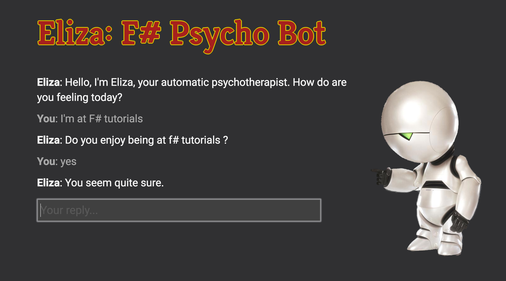](http://eliza-demo.azurewebsites.net/)

---

## How does Eliza work?

<table>
<tr>
  <td class="noborder"> <h3>Pattern</h3> </td>
  <td class="noborder"> <h3>Answers</h3> </td>
</tr>
<tr>
  <td class="noborder"></td>
  <td class="noborder"> Why do you need * ? </td>
</tr>
<tr>
  <td class="noborder"> I need * </td>
  <td class="noborder"> Would it really help you to get * ? </td>
</tr>
<tr>
  <td class="noborder"></td>
  <td class="noborder"> Are you sure you need * ? </td>
</tr>
</table>

---

## How does Eliza work?  🍰

<table>
<tr>
  <td class="noborder"> <h3>Pattern</h3> </td>
  <td class="noborder"> <h3>User input</h3> </td>
</tr>
<tr>
  <td class="noborder">I need *</td>
  <td class="noborder"> I need some cake </td>
</tr>
</table>

---

## How does Eliza work? 🍰

<table>
<tr>
  <td class="noborder"> <h3>User input</h3> </td>
  <td class="noborder"> <h3>Answers</h3> </td>
</tr>
<tr>
  <td class="noborder"></td>
  <td class="noborder"> Why do you need some cake? </td>
</tr>
<tr>
  <td class="noborder"> I need some cake </td>
  <td class="noborder"> Would it really help you to get some cake? </td>
</tr>
<tr>
  <td class="noborder"></td>
  <td class="noborder"> Are you sure you need some cake? </td>
</tr>
</table>

---

<table>
<tr>
  <td class="noborder"> <h3>Pattern</h3> </td>
  <td class="noborder"> <h3>User input</h3> </td>
</tr>
<tr>
  <td class="noborder">I need *</td>
  <td class="noborder"> I need some cake </td>
</tr>
</table>

  

# Unification!

Find substitution that unifies two expressions

---

# The whole process 

1. Get user input
2. Find matching pattern
3. Extract substitution
4. Select answer and insert substitution
5. Reply to user

---

## What we're going to do:

1. Parse input into words and wildcards
2. Load data using Json type provider
3. Write unification
4. Insert substitution into answer and reply
5. Deploy locally
6. Deploy to Azure and use in Slack

****

# Link to slides

[evelinag.com/eliza](http://evelinag.com/eliza)

----

# Give me your email
## fseliza.slack.com
 

[https://goo.gl/forms/weGhrcWi3nCRNUUB2](https://goo.gl/forms/weGhrcWi3nCRNUUB2)

---

# Download two github repositories

[github.com/evelinag/eliza-tutorial](https://github.com/evelinag/eliza-tutorial)

[github.com/evelinag/eliza-slack](https://github.com/evelinag/eliza-slack)

****

# Deploying to Azure

---

# The Deploy button

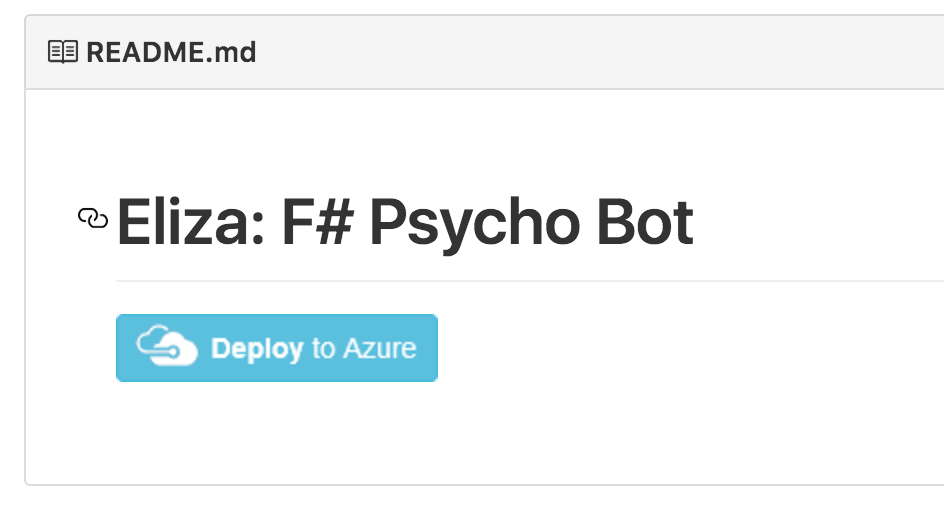

---

### Azure portal: Deployment options

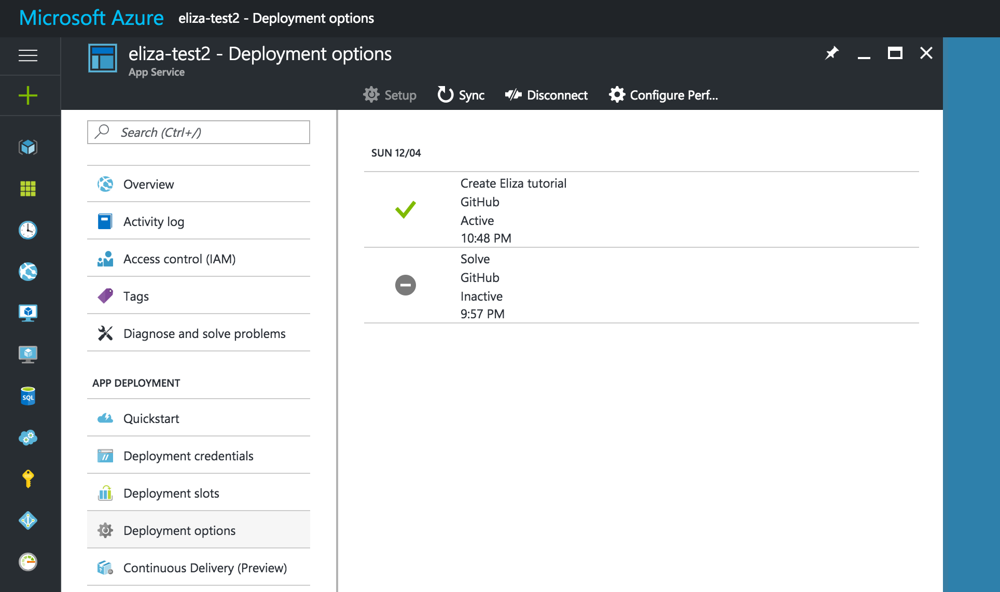

---

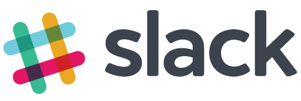

# Integration

- Custom integration
- Slack App

---

# Custom integration

- Slash command
- Bot users - Real Time Messaging API
- App bot users - Real Time Messaging API, Events API

---

# Slack integration

### Slack commands

---

# Slack integration

[fseliza.slack.com](https://fseliza.slack.com/messages/general/)

---

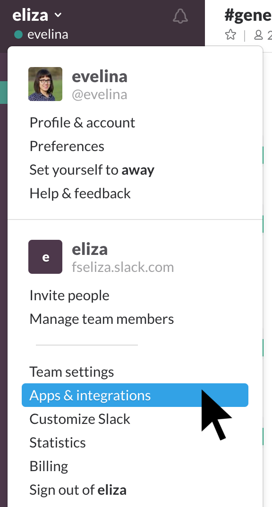

---

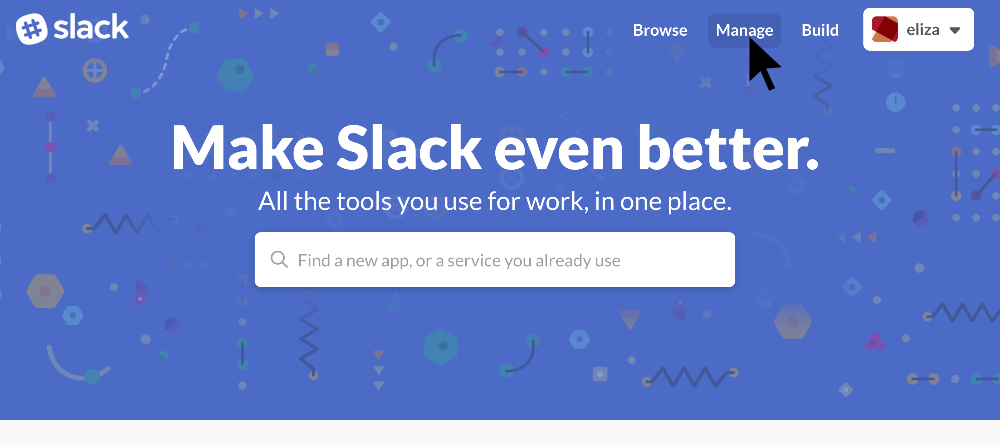

---

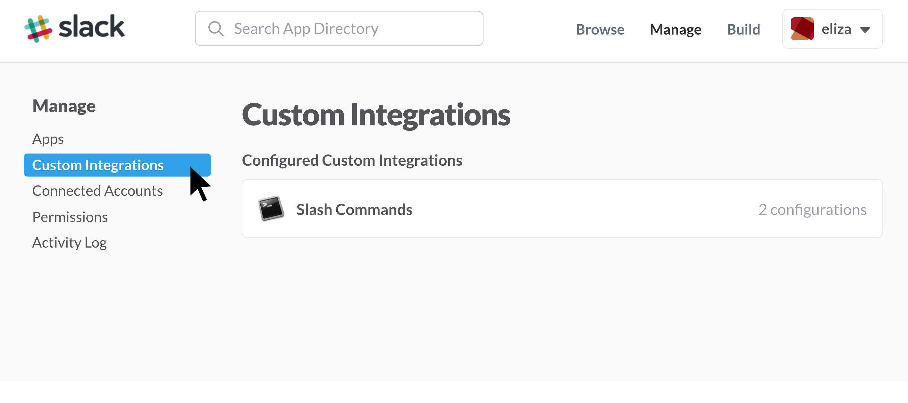

---

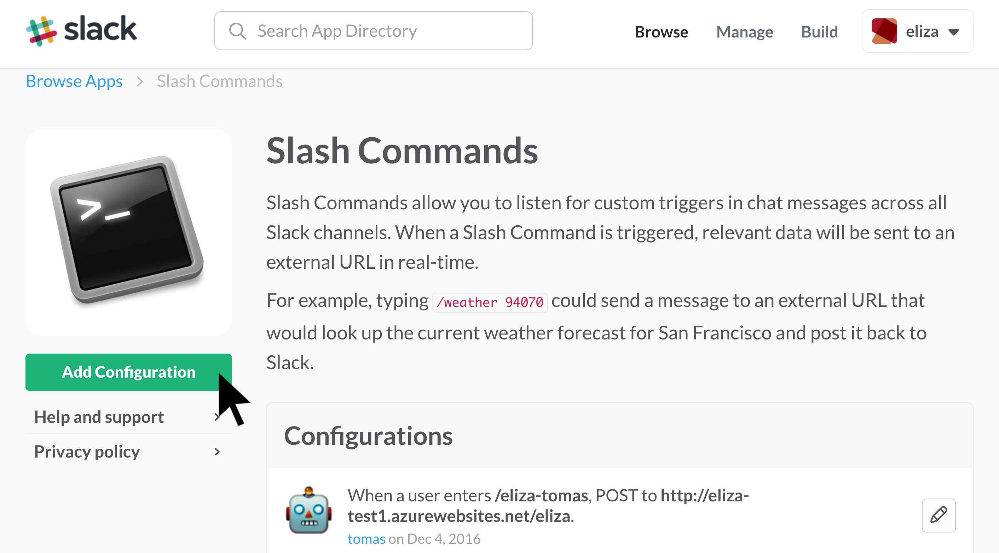

---

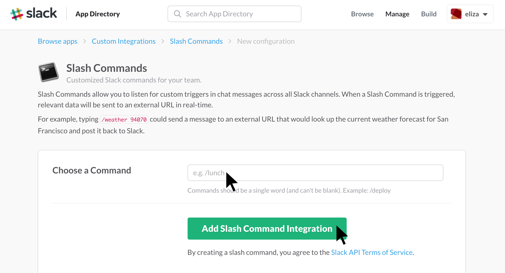

---

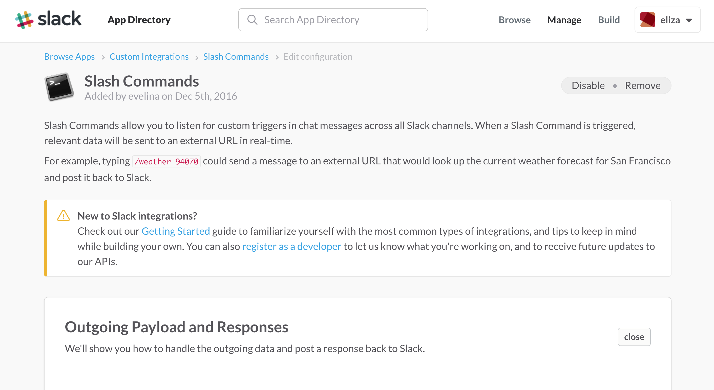

---

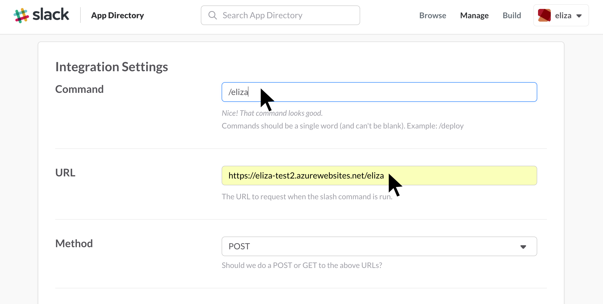

---

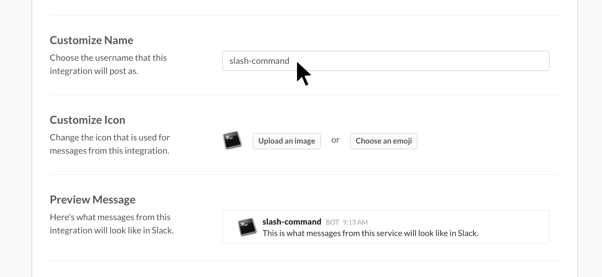

---

****

# Learning more

- Dustin Moris Gorski: [Creating a Slack bot with F# and Suave in less than 5 minutes](https://dusted.codes/creating-a-slack-bot-with-fsharp-and-suave-in-less-than-5-minutes)

- [Custom integrations on Slack](https://api.slack.com/custom-integrations)

- Joseph Weizenbaum - Computer Power and Human Reason: From Judgment To Calculation.

